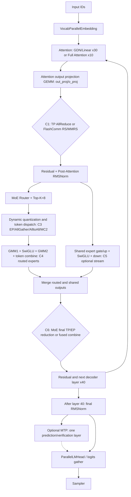

# Qwen3.6-35B-A3B-w8a8 通算融合算子理论分析结论

## 结论摘要

以 **TP=2、单请求、2048-token Prompt、text-only、关闭 EP/MTP、310P 默认路径** 为基线：

- 从整个网络的通信边界看，每个 Decoder 层最多有两处主要 TP 规约：Attention 输出规约和 MoE 输出规约，共约 40+40 个边界。
- 若严格限定为“单个 GEMM 输出矩阵 C 生成后立即执行 TP AllReduce”的候选，仍然只有下面两组，共 40 次/层栈：

  1. 30 个 Linear/GDN Attention 的 `out_proj GEMM → AllReduce`
  2. 10 个 Full Attention 的 `o_proj GEMM → AllReduce`

- 两组 GEMM 的形状完全相同：

  - Prefill：`A[2048,2048] × B[2048,2048] → C[2048,2048]`
  - Decode：`A[1,2048] × B[2048,2048] → C[1,2048]`
  - Decode Split-K=2：两个 `A[1,1024] × B[1024,2048] → partial C[1,2048]`，本地求和后得到最终 `C[1,2048]`

- 以 `P=8 AIC/卡`、通信粒度 `128×256` 为代表性评估点：

  - Prefill：Overlap 窗口系数 `93.75%`，单算子对延迟收益理论上限 `46.875%`
  - Decode 默认 Tile：只有一个 wave，理论 Overlap 为 `0`
  - Decode Split-K=2：Overlap 窗口系数 `50%`，单算子对延迟收益理论上限 `25%`
  - 但 Decode Split-K=2 每个通信 wave 只有约 `2 KiB` 数据，实际收益很可能显著低于 25%，甚至被本地 partial reduce 和通信启动开销抵消。

- 当前 vllm-ascend 源码仍是 GEMM 完成后再 AllReduce，因此当前实现的实际通算 Overlap 是 0；上述数字是开发自定义 310P 通算融合算子的理论空间。

- 全模型的通信隐藏收益不能只用上述两组直接 GEMM→AllReduce 表示：MoE 路由、共享专家多流、MoE 最终合并规约、FlashComm/Sequence Parallel 的 RS/AG 边界，以及启用 speculative decode 时的 MTP 分支都需要单独列出，但它们的融合粒度和适用配置不同。

## 1. 模型和运行基线

目标模型配置给出：

- `hidden_size=2048`
- 40 层
- 每 4 层一个 Full Attention，因此 30 层 Linear/GDN Attention、10 层 Full Attention
- Full Attention：16 个 Query Head，`head_dim=256`
- Linear Attention：32 个 Value Head，`value_head_dim=128`
- 256 个专家、Top-K=8、专家中间维度 512

依据见 [config.json](/home/ubuntu/codes/npu_qwen36/Qwen3.6-35B-A3B-w8a8/config.json:14)。模型卡还明确说明 Qwen3.6-35B-A3B 与 Qwen3.5-35B-A3B 结构一致，见 [README.md](/home/ubuntu/codes/npu_qwen36/Qwen3.6-35B-A3B-w8a8/README.md:19)。

TP=2 的源码基线来自现有两卡 W8A8 测试，配置为 `tensor_parallel_size=2`、关闭 EP，见 [test_qwen3_5_35b_a3b_w8a8.py](/home/ubuntu/codes/npu_qwen36/vllm-ascend/tests/e2e/pull_request/two_card/test_qwen3_5_35b_a3b_w8a8.py:31)。

需要注意：目标模型卡的精度验证硬件是 Atlas A3，不是 310P，见 [README.md](/home/ubuntu/codes/npu_qwen36/Qwen3.6-35B-A3B-w8a8/README.md:13)。所以本文的 310P 收益属于“源码结构 + 硬件理论”估算，不能等同于实测结果。

### W8A8 的重要例外

这个模型不是所有 GEMM 都使用 INT8：

- `self_attn.o_proj` 被显式排除在 W8A8 之外，见 [量化配置](/home/ubuntu/codes/npu_qwen36/Qwen3.6-35B-A3B-w8a8/Qwen3.5-35B-A3B_best_practice.yaml:18)
- `linear_attn.out_proj.weight` 是 `FLOAT`，见 [quant_model_description.json](/home/ubuntu/codes/npu_qwen36/Qwen3.6-35B-A3B-w8a8/quant_model_description.json:339)
- `self_attn.o_proj.weight` 同样是 `FLOAT`，见 [quant_model_description.json](/home/ubuntu/codes/npu_qwen36/Qwen3.6-35B-A3B-w8a8/quant_model_description.json:7304)

因此本文候选算子对实际上是：

> FP16/BF16 Attention Output GEMM → TP AllReduce(sum)

310P 分析采用 FP16；FP16/BF16 都是 2 Bytes，通信量计算相同。

## 2. 全模型通信边界总览

### 2.1 适用范围和配置分层

下表将“存在通信”与“可以把通信隐藏在计算后面”分开。当前目标命令没有 `--enable-expert-parallel`、没有 `enable_flashcomm1`、没有 MTP，因此首先看 **TP=2、EP=off、FlashComm1=off、DP=1、PP=1** 的 310P 基线；扩展配置单独标注。

| 配置层 | 关键开关 | 通信路径含义 | 本项目结论 |
|---|---|---|---|
| 基线 A：TP-only | `TP=2`、EP off、FlashComm1 off | Attention 输出和 MoE 输出在各自计算完成后做 TP AllReduce；MoE 路由主要是本地路由 | 适合验证“严格 GEMM→AllReduce”和 MoE 末端规约的理论空间 |
| 扩展 B：TP+EP | `--enable-expert-parallel` | MoE 进入 EP 路由/Dispatch/Combine 路径，通信不再只是一个末端 AllReduce | 需要按实际 `AllGather/AlltoAll/MC2` Kernel 单独建模 |
| 扩展 C：FlashComm1/SP | `enable_flashcomm1=true` 或对应 SP pass | 将部分 `AllReduce→Norm` 改成 `ReduceScatter→Norm→AllGather`，并延迟 MoE 的 AllGather | 具有通信量削减和流水重叠价值；MoE 场景要求 EP，不能直接套用基线公式 |
| 扩展 D：共享专家多流 | `multistream_overlap_shared_expert=true` | 共享专家计算流与路由/GMM/Combine 通信并行 | 通用 vllm-ascend 可评估；当前 310P 专用 MoE Runner 将该开关强制置为 `False` |

### 2.2 全模型通信收益点总表

Qwen3.6-35B-A3B-w8a8 有 40 个 Decoder 层：30 个 Linear/GDN Attention 层和 10 个 Full Attention 层；每层都有一个 MoE Block。下表是全量通信边界，而不只列“可直接做通算融合”的算子对。

| 编号 | 模型位置 | 次数/层栈 | 通信或同步边界 | 通信前后的计算 | TP=2、EP off、310P 基线 | 通信隐藏收益判断 |
|---|---|---:|---|---|---|---|
| C0 | 输入 `VocabParallelEmbedding` | 1 | 词表分片后的聚合/规约（是否发生取决于 embedding 实现） | 查表 → 首层 RMSNorm | 只发生在请求开头；没有可稳定利用的后续独立大 GEMM | 低，不作为主要收益点 |
| C1 | 30 个 GDN/Linear Attention 的 `out_proj` | 30 | RowParallel GEMM 后 TP AllReduce；FlashComm 下可变为 RS/MMRS 路径 | GDN Core → `out_proj` GEMM → 通信 | 严格的 GEMM→AllReduce 候选 | **最高优先级**；Prefill 有大量 Tile，Decode 需看真实 Tile |
| C2 | 10 个 Full Attention 的 `o_proj` | 10 | RowParallel GEMM 后 TP AllReduce；FlashComm 下可变为 RS/MMRS 路径 | QKV/Attention/gate → `o_proj` GEMM → 通信 | 严格的 GEMM→AllReduce 候选 | **最高优先级**；与 C1 的 M/N/K 和数据类型相同 |
| C3 | MoE Router/Top-K/动态量化后的 Dispatch | 40 | EP/FlashComm 路径可能出现 AllGather、AlltoAll 或 MC2；310P 选择逻辑为 AllGather | Router `M×2048→M×256` → Top-K=8 → 量化/Dispatch | EP off 时不发生跨卡专家 Token 交换，主要是本地路由 | 中等；需要把通信隐藏在量化、共享专家或专家计算中，不能当作单 GEMM→AR |
| C4 | Routed Expert `GMM1→SwiGLU→GMM2→unpermute/combine` | 40 | 计算本身通常是本地 GMM；通信可能嵌在 Dispatch/Combine | 路由 Token → GMM1 → 激活 → GMM2 → Token 合并 | GMM2 输出是按专家分组的变长 Token，不存在统一的 `C[M,N]` | 中等偏低；需设计 GMM2+Combine+规约复合 Kernel |
| C5 | Shared Expert 分支 | 40 | 可在独立 NPU Stream 上与 Routed Expert 的 Dispatch/GMM2/Combine 并行 | Shared gate/up → SwiGLU → down_proj → shared gate | 当前 310P `AscendMoERunner310` 禁用多流共享专家 | 通用平台可评估；**当前 310P 基线不可直接实现** |
| C6 | MoE Routed+Shared 合并后的最终输出 | 40 | TP/EP 最终 AllReduce、ReduceScatter 或融合 Combine | Routed 输出 + Shared 输出 → 最终规约 | EP off 时通常是 `[M,2048]` 的 TP AllReduce；这是除 C1/C2 外的第二类主要通信边界 | 计算量大，但不是单 GEMM 直接产物；需融合 Combine/加权/规约 |
| C7 | FlashComm1/Sequence Parallel 的层间边界 | 每个适用层 | `AllReduce→RMSNorm` 改为 `ReduceScatter→RMSNorm→AllGather`；MoE 中进一步延迟 AllGather 到 Gate/动态量化之后 | Attention 输出、残差、Norm、Router/量化之间 | 基线关闭；开启后会改变 C1/C6 的通信形态和 Shape | **通信量削减 + 流水重叠**，但必须按新图重新采集，不能沿用基线 Tile 公式 |
| C8 | 最终 `ParallelLMHead`/Logits 聚合 | 1 | 词表分片 Logits 的 Gather/规约 | Final RMSNorm → LM Head → Sampler | 通信后几乎没有模型计算 | 低，不建议作为通算融合目标 |
| C9 | DP/PP/PCP 等额外并行边界 | 0（当前配置） | DP AllGather/ReduceScatter、PP Send/Recv 或 PCP 通信 | 跨请求、跨 Pipeline 或跨上下文分片 | 当前 `DP=1、PP=1、PCP=1`，不纳入本轮收益 | 需要改变并行配置后另行建模 |
| C10 | MTP/speculative decode 分支（可选） | `mtp_num_hidden_layers=1`；每轮由 `1+K` 个验证/预测 token 决定 | 额外 MTP 层的 Attention/MoE TP 规约，以及验证阶段的 token 批处理同步 | Decode 主干 → MTP 预测层 → 共享 LM Head/验证 | 当前理论基线关闭；若启用 `--speculative-config`，Decode 的 `M` 变为实际验证 token 数 | 需按 `K`、接受率和实际 capture size 单独采集；不能直接套用单 token Decode 结论 |

### 2.3 模型执行时序图

下面的图表示每个 Decoder 层的主路径。`×30/×10` 表示两种 Attention 层的出现次数，`×40` 表示每层都有 MoE。



图中真正适合直接套用 `Tile 数量→Wave→T_hide` 公式的是 **C1/C2** 两个 Attention 输出投影 GEMM；C6 虽然最终也形成 `[M,2048]` 输出，但必须先把 MoE Combine 后的规约粒度定义清楚。C3/C4/C5/C7/C10 属于通信流水、路由、多流重叠或 speculative 分支，必须使用事件时间线或专用 Kernel 的 TilingData 评估。

### 2.4 通信点的收益优先级

| 优先级 | 通信点 | 推荐动作 | 原因 |
|---|---|---|---|
| P0 | C1/C2：Attention 输出投影 GEMM→TP AllReduce | 先做两个直接融合 Kernel | 40 个实例、输出矩阵统一，Prefill 的 GEMM Tile 数量多，最容易验证收益 |
| P1 | C6：MoE 最终合并→TP 规约 | 设计 Combine+规约复合 Kernel，再测 Prefill | 40 个实例且通信 payload 与 C1/C2 同为 `[M,2048]`，但前面有变长专家 Token 合并 |
| P1 | C7：FlashComm1/SP 的 RS/AG 边界 | 在 EP/FlashComm 配置下重新画图并采集 | 它改变通信量和执行顺序，可能覆盖 C1/C6 的部分通信 |
| P2 | C3/C4：MoE Dispatch/Experts | 只有启用 EP 或特定融合 Kernel 后评估 | 通信粒度受专家负载和 Token 路由影响，不能用固定 `C[M,N]` 代替 |
| P2 | C5：Shared Expert 多流 | 在支持该功能的平台上测；310P 先标记不可用 | 现有代码已有事件依赖，但 310P 专用 Runner 明确关闭 |
| P2 | C10：MTP/speculative decode | 仅在打开 speculative 配置后采集验证；按 `K` 和实际 batch 建模 | MTP 改变 Decode 的 `M` 和执行次数，可能增加通信窗口，但收益受接受率与验证开销约束 |
| P3 | C0/C8：Embedding/LM Head | 只记录端到端边界耗时，不投入通算融合 | 发生次数少，且通信前后缺少稳定的可并行大计算窗口 |

### 2.5 当前 310P 基线和优化路径的明确边界

当前用户命令对应的是 **C1/C2 + C6 的基线形态**：

```text
Attention local compute
    → out_proj/o_proj GEMM
    → TP AllReduce                         (C1/C2)
    → residual + norm
    → local MoE router + local experts
    → routed/shared merge
    → TP AllReduce                         (C6)
    → residual → next layer
```

要启用扩展路径，需要分别确认：

1. `enable_flashcomm1`：源码要求 TP>1，且 MoE 模型必须同时启用 EP；开启后 C1/C6 不再是原始 AllReduce 图。
2. `--enable-expert-parallel`：使 C3/C4 进入专家并行通信路径；不能把 EP 路径的通信量套用到 EP off 基线。
3. `multistream_overlap_shared_expert`：通用 vllm-ascend 支持，但 [310P MoE Runner](/home/ubuntu/codes/npu_qwen36/vllm-ascend/vllm_ascend/_310p/fused_moe/fused_moe.py:177) 将其置为 `False`。
4. 310P 的 MoE 通信选择在 [select_moe_comm_method](/home/ubuntu/codes/npu_qwen36/vllm-ascend/vllm_ascend/ascend_forward_context.py:307) 中固定走 `ALLGATHER` 分支；不能把 A2/A3 的 MC2/Fused-MC2 结果直接当成 310P 结果。

因此，完整结论应写成：

> Qwen3.6 的通信隐藏收益点分布在每层 Attention 输出投影（C1/C2）、每层 MoE 最终输出规约（C6）、EP/FlashComm 路由边界（C3/C7）、共享专家多流（C5）以及可选 MTP 分支（C10）五类位置。对当前 TP=2、310P、EP off 基线，只有 C1/C2 是可以直接按 GEMM Tile 计算理论 Overlap 的严格候选；C6 是高价值但需要 Combine 复合 Kernel；C3/C5/C7/C10 必须以实际并行配置和事件时间线重新评估。

## 3. 可融合算子对和调用链

### 严格候选

| 编号 | 算子对 | 层数/调用次数 | 调用链 |
|---|---|---:|---|
| P1 | Linear Attention `out_proj GEMM → TP AllReduce` | 30 | `Qwen3_5DecoderLayer` → `QwenGatedDeltaNetAttention` → GDN Core → `RMSNormGated` → `out_proj(RowParallelLinear)` → GEMM → AllReduce |
| P2 | Full Attention `o_proj GEMM → TP AllReduce` | 10 | `Qwen3_5DecoderLayer` → `Qwen3NextAttention` → QKV → Attention → sigmoid gate → `o_proj(RowParallelLinear)` → GEMM → AllReduce |

Full Attention 位于 0-based 层号：

```text
3, 7, 11, 15, 19, 23, 27, 31, 35, 39
```

其余 30 层为 Linear Attention。

vLLM 的结构证据：

- [Qwen3.5 DecoderLayer 按 layer_type 选择两种 Attention](https://github.com/vllm-project/vllm/blob/85c09e9885e346ea1612da30ebff5a75f67d2350/vllm/model_executor/models/qwen3_5.py#L112-L153)
- [Full Attention 创建 RowParallelLinear o_proj](https://github.com/vllm-project/vllm/blob/85c09e9885e346ea1612da30ebff5a75f67d2350/vllm/model_executor/models/qwen3_next.py#L225-L276)
- [Full Attention forward 中 o_proj 紧跟 Attention 输出](https://github.com/vllm-project/vllm/blob/85c09e9885e346ea1612da30ebff5a75f67d2350/vllm/model_executor/models/qwen3_next.py#L381-L392)
- [GDN 创建 RowParallelLinear out_proj](https://github.com/vllm-project/vllm/blob/85c09e9885e346ea1612da30ebff5a75f67d2350/vllm/model_executor/layers/mamba/gdn/qwen_gdn_linear_attn.py#L443-L552)
- [GDN 输出投影调用](https://github.com/vllm-project/vllm/blob/85c09e9885e346ea1612da30ebff5a75f67d2350/vllm/model_executor/layers/mamba/gdn/qwen_gdn_linear_attn.py#L850-L867)
- [RowParallelLinear 中 GEMM 后立即 AllReduce](https://github.com/vllm-project/vllm/blob/85c09e9885e346ea1612da30ebff5a75f67d2350/vllm/model_executor/layers/linear.py#L1672-L1692)

vllm-ascend 的普通路径也是先执行量化方法/GEMM，再调用 TP AllReduce，见 [linear_op.py](/home/ubuntu/codes/npu_qwen36/vllm-ascend/vllm_ascend/ops/linear_op.py:470)。

### 不作为简单算子对的候选

| 近似候选 | 未纳入原因 |
|---|---|
| Routed Expert `GMM2 → AllReduce` | GMM2 输出仍是 Top-K 展开的 expert token；之后还有加权、token unpermute/combine，不能把 GMM2 的 C Tile 直接交给最终 AllReduce |
| Shared Expert `down_proj → AllReduce` | `down_proj` 后还有 shared gate、与 routed output 相加，最终才进行 TP AllReduce |
| MoE MC2/通信融合 | 当前源码对 MoE 模型设置 `mmrs_fusion=False`；310P 的 MoE 通信选择固定为 AllGather |
| LM Head | 一般是词表并行/gather，不是这里的 GEMM→AllReduce 模式 |
| Vision Encoder | 2048 个纯文本 token 不执行 Vision 分支 |
| MTP 层 | 默认生成未启用 speculative/MTP 时不执行 |

310P W8A8 专家路径实际是 `GMM1 → SwiGLU → GMM2`，见 [moe_mlp.py](/home/ubuntu/codes/npu_qwen36/vllm-ascend/vllm_ascend/_310p/fused_moe/moe_mlp.py:37)；最终 AllReduce 位于 MoE 结果合并之后，见 [fused_moe.py](/home/ubuntu/codes/npu_qwen36/vllm-ascend/vllm_ascend/ops/fused_moe/fused_moe.py:542)。

## 4. TP=2 时 M、N 的推导

### P1：Linear/GDN Attention out_proj

全局输入维度：

\[
K_{global}=linear\_num\_value\_heads\times linear\_value\_head\_dim
=32\times128=4096
\]

Row Parallel 在 K 轴按 TP 切分：

\[
K_{local}=4096/2=2048
\]

输出维度等于 hidden size：

\[
N=2048
\]

### P2：Full Attention o_proj

全局输入维度：

\[
K_{global}=num\_attention\_heads\times head\_dim
=16\times256=4096
\]

TP=2 后：

\[
K_{local}=4096/2=2048,\quad N=hidden\_size=2048
\]

因此两组算子对具有完全相同的 GEMM 形状。

| 场景 | 每卡逻辑 GEMM | 最终 C[M,N] | 每次计算量/卡 | AllReduce 输入/卡 |
|---|---|---|---:|---:|
| Prefill 2048 token | `A[2048,2048] × B[2048,2048]` | `[2048,2048]` | 17.18 GFLOP | 8 MiB |
| Decode 默认，batch=1 | `A[1,2048] × B[2048,2048]` | `[1,2048]` | 8.39 MFLOP | 4 KiB |
| Decode Split-K=2 | 2 个 `A[1,1024] × B[1024,2048]` | 两个 partial `[1,2048]`，本地求和后仍为 `[1,2048]` | 总 GEMM FLOP 基本不变，增加 partial reduce | 4 KiB |

关键点：Decode 时历史上下文长度 2048 影响 Attention/KV Cache 的计算量，但不影响输出投影的 M。单请求每步只产生一个新 token，所以 `M=1`。

若 Decode batch 为 B，则应替换为：

\[
M=B
\]

若启用 chunked prefill，则 Prefill 的 M 是当前 chunk 内实际调度的 token 数，而不一定一次就是 2048。

## 5. Overlap 空间与收益表

### Tile 假设

310P3 每卡按 `P=8` 个 AIC 计算。华为 MindSDK 的 Ascend310P3 算子生成配置也采用 `core_num=8`；硬件卡规格为 70 TFLOPS FP16、204.8 GB/s、PCIe x16 Gen4，见[华为 Atlas 300I Pro 官方规格](https://e.huawei.com/cn/products/computing/ascend/atlas-300-ai)。

CANN 不在 vllm 源码中固定默认 Tile，而是运行时生成 `TCubeTiling`；官方文档也区分 `singleCoreM/N` 和内部 `baseM/N`，见 [TCubeTiling 定义](https://www.hiascend.com/document/detail/en/canncommercial/850/API/ascendcopapi/atlas_ascendc_api_07_0673.html)。

本次代表性评估采用：

- Prefill 通信粒度：`Tm=128, Tn=256`
- Decode 尾块：`1×256`
- Split-K=2：两个 AIC 合作完成一个 C Tile，因此有效并行度 `P_eff=8/2=4`

`128×256` 的依据是 CANN 对大形状 FP16 MatMul 给出的经验优选基本块，见[官方 MatMul Tiling 优化案例](https://www.hiascend.com/document/detail/en/canncommercial/850/opdevg/Ascendcopdevg/atlas_ascendc_best_practices_10_0041.html)。

### 场景收益

令单算子对串行基线：

\[
T_{base,pair}=T_{mm}+T_{AR}
\]

则：

\[
Gain_{pair}=r\frac{\min(T_{mm},T_{AR})}{T_{mm}+T_{AR}}
\]

因为：

\[
\frac{\min(T_{mm},T_{AR})}{T_{mm}+T_{AR}}\leq\frac12
\]

所以真正的延迟收益上限是窗口系数的一半，而不是窗口系数本身。

| 场景 | C Tile | Tile 数 Q | 有效 AIC | W | 窗口系数 r | 理论隐藏时间 | 单算子对收益上限 | 每个通信 wave |
|---|---:|---:|---:|---:|---:|---|---:|---:|
| Prefill | `128×256` | `16×8=128` | 8 | 16 | 93.75% | `0.9375×min(Tmm,TAR)` | **46.875%** | 512 KiB |
| Decode 默认 | `1×256` | 8 | 8 | 1 | 0 | 0 | **0%** | 4 KiB，且只有一轮 |
| Decode Split-K=2 | `1×256` | 8 | 4 | 2 | 50% | `0.5×min(Tmm_split2,TAR)` | **25%** | 2 KiB |

Split-K 的 wave 计算为：

\[
W_{split2}=\left\lceil\frac{Q}{\lfloor P/2\rfloor}\right\rceil
=\left\lceil\frac{8}{4}\right\rceil=2
\]

`Tmm_split2` 必须包含两个 K partial 的本地求和成本。

### 每组算子对的模型级贡献

| 算子对 | 次数 | Prefill 可隐藏时间贡献 | Decode 默认 | Decode Split-K=2 |
|---|---:|---|---:|---|
| P1：GDN `out_proj + AR` | 30 | `30×0.9375×min(Tgdn,TAR)` | 0 | `30×0.5×min(Tgdn_split2,TAR)` |
| P2：Full Attention `o_proj + AR` | 10 | `10×0.9375×min(Tfull,TAR)` | 0 | `10×0.5×min(Tfull_split2,TAR)` |
| 总计 | 40 | 上述两项之和 | 0 | 上述两项之和 |

由于两类投影的 M/N/K 和数据类型相同，可近似认为 `Tgdn≈Tfull`，因此 P1 和 P2 的贡献约为 3:1。

若 `T_base` 是端到端模型耗时，而不是单算子对耗时，则最终模型收益应计算为：

\[
Gain_{e2e}=\frac{30T_{hide,gdn}+10T_{hide,full}}{T_{base,e2e}}
\]

没有上机取得 `T_{base,e2e}` 前，不能把 46.875% 或 25% 当成端到端模型收益。

## 6. Tile 敏感性

运行时实际 Tile 对 Decode 结论影响很大。

### Prefill

| Tm×Tn | Tile 数 | W | 窗口系数 | 单对收益上限 |
|---|---:|---:|---:|---:|
| 128×128 | 256 | 32 | 96.875% | 48.438% |
| 128×256 | 128 | 16 | 93.750% | 46.875% |
| 256×256 | 64 | 8 | 87.500% | 43.750% |
| 512×512 | 16 | 2 | 50.000% | 25.000% |

### Decode，M=1

| Tn | 默认 Tile：窗口/收益上限 | Split-K=2：窗口/收益上限 |
|---:|---:|---:|
| 128 | 50% / 25% | 75% / 37.5% |
| 256 | 0% / 0% | 50% / 25% |
| 512 | 0% / 0% | 0% / 0% |

所以在没有拿到真实 `TCubeTiling` 前，最稳妥的表述是：

> Decode 默认 Tile 在 `Tn≥256` 时没有 Overlap 空间；Split-K=2 只有在 `Tn≤256` 时才制造出后续 wave。

## 7. 硬件层面的实际收益判断

Atlas 300I Pro/Ascend 310P3 的官方规格是 70 TFLOPS FP16、204.8 GB/s、PCIe Gen4 x16。

- Prefill 每次投影每卡约 17.18 GFLOP。按 70 TFLOPS 峰值，纯计算下界约：

  \[
  17.18G / 70T \approx 245\ \mu s
  \]

  同时需要 AllReduce 8 MiB，计算与通信在数量级上都有可能形成有价值的重叠。因此 Prefill 是最高优先级。

- Decode 每次投影只有 8.39 MFLOP，但本地 FLOAT 权重约 8 MiB。若每步需要从外存读取一次，按 204.8 GB/s 对应约 41 μs 的权重读取时间；AllReduce 数据却只有 4 KiB，明显是通信启动延迟主导。

- Split-K=2 后第一轮只产生 4 个 `1×256` C Tile，即约 2 KiB。即使第二个 wave 提供了约半个 GEMM 的覆盖窗口，小消息 HCCL/MC2 启动和 partial reduce 成本也可能吃掉收益。

因此优先级建议是：

1. **优先实现 Prefill 的两类 Attention output projection + AllReduce。**
2. **Decode 默认 Tile 不建议投入，代表性 Tile 下理论空间为 0。**
3. **Decode Split-K=2 只建议做原型验证；必须以实测确认是否正收益。**
4. **MoE GMM2 不按简单算子对处理，若要做需要设计 GMM2 + token combine + shared add + communication 的复合融合。**

## 8. 当前源码支持边界

当前源码对于 MoE 模型显式关闭 MMRS 融合，见 [ascend_forward_context.py](/home/ubuntu/codes/npu_qwen36/vllm-ascend/vllm_ascend/ascend_forward_context.py:133)；310P 的 MoE 通信方式固定选择 AllGather，见 [ascend_forward_context.py](/home/ubuntu/codes/npu_qwen36/vllm-ascend/vllm_ascend/ascend_forward_context.py:307)。

CANN 标准 `MatmulAllReduce` 文档还注明：

- 增量 Decode 场景不使能 MC2
- 公开支持平台主要是 Atlas A2/Atlas 350 和 HCCS all-mesh，并未列出 310P PCIe 卡

见[官方 aclnnMatmulAllReduceV2 文档](https://www.hiascend.com/document/detail/zh/CANNCommunityEdition/900beta2/API/aolapi/context/ops-transformer/aclnnMatmulAllReduceV2.md)。

所以目标落地不是简单把 vllm API 换成现成 MC2 接口，而更可能需要 310P 自定义 Ascend C 算子，在 kernel 内按 C Tile 调用通信 API。

最终上机时必须补齐三个量：

- 从真实 `TCubeTiling` 读取 `singleCoreM/N`、`baseM/N`
- 分别 profile `Tmatmul`、`TAllReduce`
- 明确 `Tbase` 是单算子对还是端到端 Prefill/Decode 延迟

得到这些值后，直接代入上述两组 30/10 次的模型级公式即可得到最终可签字的收益数字。
